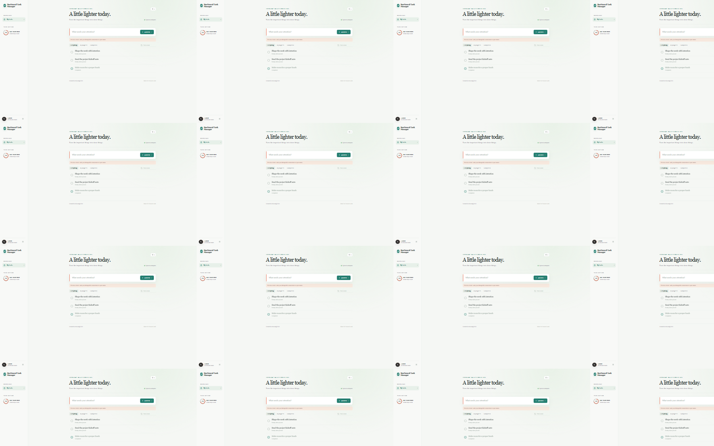
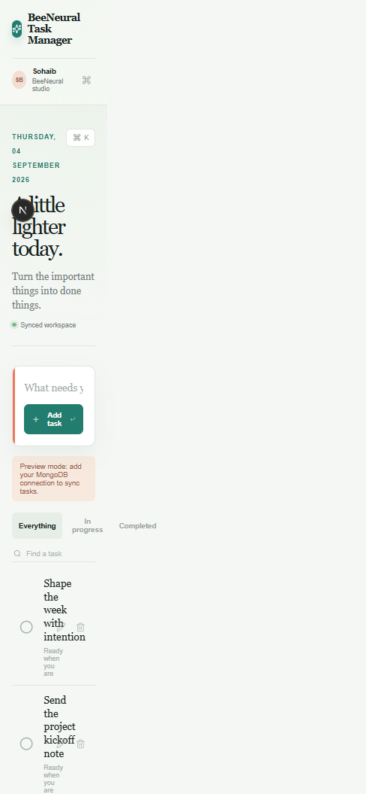

# BeeNeural Task Manager

BeeNeural Task Manager is a focused place to collect the work that needs your attention and move it, one task at a time, to done. I built it as a full-stack project with a calm, responsive interface and a small REST API backed by MongoDB.

The main screen keeps the workflow intentionally simple: add a task, mark it complete, edit its title, or remove it. Search and filters make the list comfortable to use as it grows. When MongoDB is not configured, the interface falls back to preview tasks so the experience can still be explored locally.

## Screenshots

The desktop workspace keeps the task list visible and the primary action close at hand. The layout also adapts down to a compact mobile view without hiding the important controls.





## Stack

- Next.js App Router and TypeScript
- React with native `fetch`
- Route Handlers for the REST API
- MongoDB with Mongoose
- Tailwind CSS and a small custom CSS system
- Lucide icons

## Run it locally

1. Open the project directory and install packages:

   ```bash
   cd task-manager
   npm install
   ```

2. Create `.env.local` from `.env.example` and paste in the MongoDB connection string.

3. Start the app:

   ```bash
   npm run dev
   ```

4. Open `http://localhost:3000`.

The MongoDB user needs permission to read and write the selected database. In MongoDB Atlas, also add your current IP address under Network Access.

## API

- `GET /api/tasks` returns tasks, newest first.
- `POST /api/tasks` creates a task from `{ "title": "..." }`.
- `PATCH /api/tasks/:id` updates `title` and/or `completed`.
- `DELETE /api/tasks/:id` removes a task.

## Before publishing

Keep `.env.local` private. For a public deployment, add the same `MONGODB_URI` value in the hosting provider's environment settings. I would also add authentication before turning this into a multi-user product, since the current API is intentionally a single-workspace starting point.

## Git workflow

A sensible first commit sequence is:

```bash
git add . && git commit -m "chore: scaffold Next.js task manager"
git add src/models src/lib src/app/api && git commit -m "feat: add MongoDB task API"
git add src/app && git commit -m "feat: build Daymark task workspace"
git push -u origin main
```

To publish it, create an empty public repository on GitHub, add it as `origin`, and run the final push command. The local environment must also have a Git identity configured before commits can be created.

Sohaib/BeeNeural@2026
